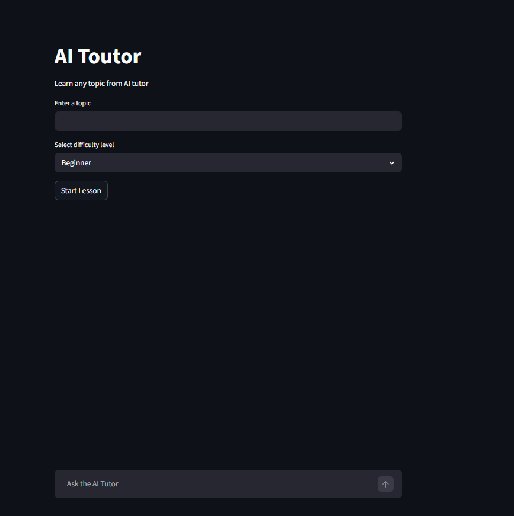
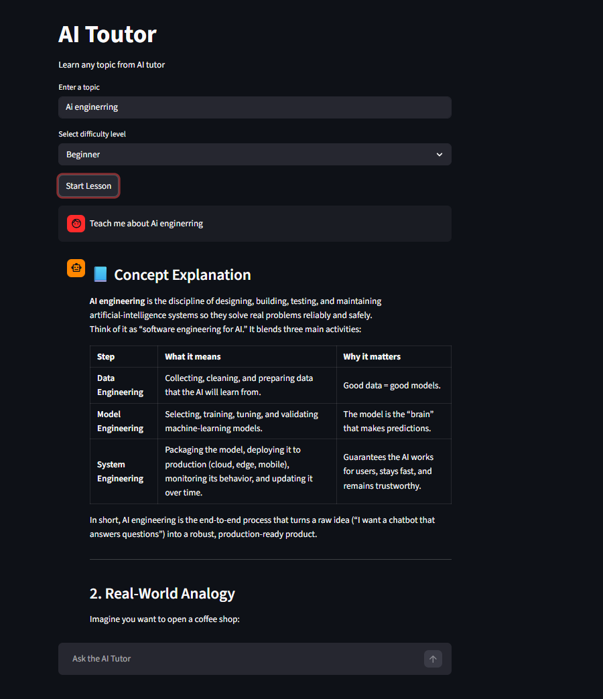

# 📚 AI Tutor – Generative AI Learning Assistant

An **AI-powered tutor application** that teaches any topic with structured explanations, real-world analogies, examples, and practice questions.

The tutor also evaluates student answers and provides feedback, creating an **interactive AI learning loop**.

Built with **Python, Streamlit, and Groq LLM APIs**, this project demonstrates how modern **Generative AI applications are architected and deployed**.

---

# 🚀 Live Demo

Try the AI Tutor here:

🔗 **Live Application:**
[YOUR_DEPLOYED_LINK_HERE](https://alok-ai-tutor.streamlit.app/)

---

# 📸 Screenshots

## Tutor Interface

---

## Practice Question & Evaluation

---

# 🚀 Features

### 🧠 Structured Teaching

The AI tutor explains topics using a structured format:

* Concept Explanation
* Real World Analogy
* Example
* Practice Question

---

### 💬 Conversational Learning

Students can ask follow-up questions and the AI tutor maintains **conversation context**.

---

### 📝 Practice & Evaluation

Students can submit answers to practice questions and receive:

* Correctness evaluation
* Explanation
* Correct answer
* Improvement tips

---

### 🛡 Guardrails

The system prevents unsafe or inappropriate topics using **application-level guardrails**.

---

### ⚡ Fast LLM Inference

Uses **Groq API with Llama-3 models** for extremely fast responses.

---

### 🖥 Interactive UI

Built with **Streamlit**, providing a simple and interactive chat-based learning experience.

---

# 🏗 System Architecture

User Interface (Streamlit)
↓
Input Validation + Guardrails
↓
Prompt Engineering Layer
↓
Groq LLM (Llama 3)
↓
Structured Tutor Output
↓
Practice Question
↓
Answer Evaluation

---

# 📂 Project Structure

ai-tutor-bot/

app.py

tutor/
  tutor_engine.py
  prompt_template.py
  output_parser.py
  guardrails.py

config/
  settings.py

screenshots/
  image.png
  image2.png

requirements.txt
.env
README.md

---

# ⚙ Installation

## 1️⃣ Clone the Repository

git clone https://github.com/Alok-kumar-priyadarshi/ai-tutor.git
cd ai-tutor

---

## 2️⃣ Create Virtual Environment

python -m venv venv

Activate environment

Windows
venv\Scripts\activate

Linux / Mac
source venv/bin/activate

---

## 3️⃣ Install Dependencies

pip install -r requirements.txt

---

# 🔑 Setup Environment Variables

Create a `.env` file in the project root.

GROQ_API_KEY=your_api_key_here

You can obtain a free API key from:
https://console.groq.com

---

# ▶ Run the Application

Start the Streamlit app:

streamlit run app.py

Then open the browser at:

http://localhost:8501

---

# 🧪 Example Usage

Example topic:

Binary Search
Difficulty: Beginner

The tutor will generate:

* Concept explanation
* Analogy
* Example
* Practice question

Then students can submit answers and receive feedback.

---

# 🛠 Tech Stack

* Python
* Streamlit
* Groq API
* GPT OSS 120B
* Prompt Engineering
* Session State Memory

---

# 🎯 Learning Objectives

This project demonstrates:

* Generative AI application architecture
* Prompt engineering techniques
* LLM API integration
* Structured AI outputs
* Conversational memory
* Guardrails for AI safety
* Deployable AI applications
